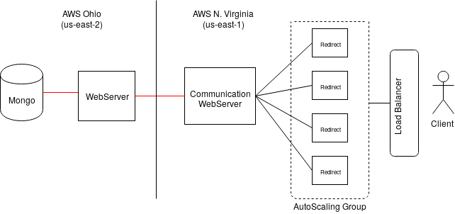

# CloudComputing

This repository was created during Cloud Computing study @ Insper (www.insper.edu.br). It contains the main individual project and some of the APS (Practical Supervisionised Activities) of this module.

## Project: "Hybrid" Cloud Webserver

The project's original purpose was to create a HC with a private database, but as it wasn't possible, the database part of the project was created in another AWS region.

### Structure

It's structure is basically as represented bellow. In 'us-east-1' (North Virginia), there is a Load Balancer, connected to an AutoScaling Group and a redirect instance that connects to 'us-east-2' (Ohio), where there's a webserver and an instance with MongoDB. The connection between Ohio's instances is locked and those can't be accessed by any other IP than North Virginia's instances (those weren't locked to the Load Balancer only because that wasn't the project's main focus).

The AutoScaling and redirect instances are only used for redirecting because (again) the main purpose of this project wasn't to build a complete application, but it's Cloud infrastructure only.  


### How to use

Having Python 3 installed, run this command to install AWS Command Line Interface and boto3 (AWS SDK for Python):
```bash
$ pip3 install awscli --upgrade --user
$ pip3 install boto3
```

Then configure your AWS Credentials:
```bash
$ aws configure
```

And run the script that is in the Project folder with:
```bash
$ python3 main.py
```
#### Note

Database script: APS1/main2.py

Redirect script: Project/redirect.py


## APS 1: REST service using FastAPI

In this activity, I created a simple RESTful webserver with 6 endpoints:
- /task - *GET*: lists all tasks;
- /task - *POST*: adds a new tasks;
- /task/<id> - *GET*: lists task with certain id;
- /task/<id> - *PUT*: updates task with certain id;
- /task/<id> - *DELETE*: deletes task with certain id;
- /healthcheck: status 200 without text;
  
How to run:
```bash
 $ uvicorn main:app --reload
```
All tests were made with Postman and FastAPI's interface.

## APS 2: Creating a Client

Using the webserver created in APS1, created a python script for a client with the same endpoints as previously. The commands are the following:

```bash
  $ ./task list
  $ ./task search <id>
  $ ./task add <name> <description>
  $ ./task update <id> <name> <description>
  $ ./task delete <id>
```Cloud infrastructure only
